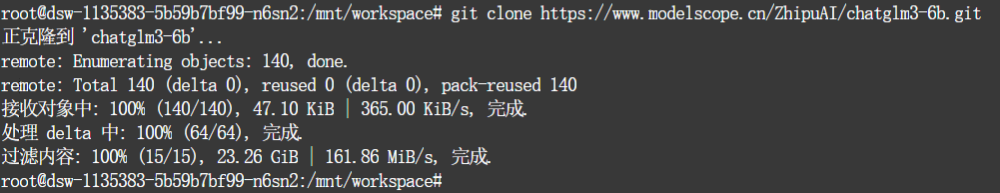
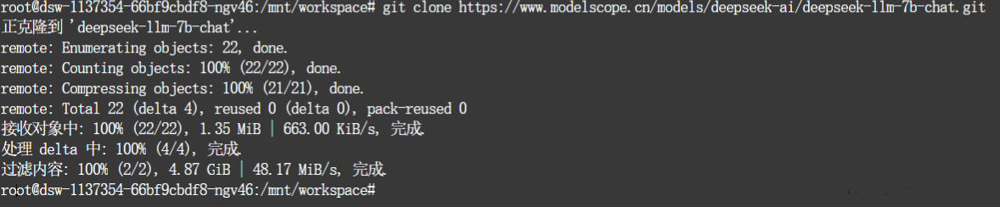
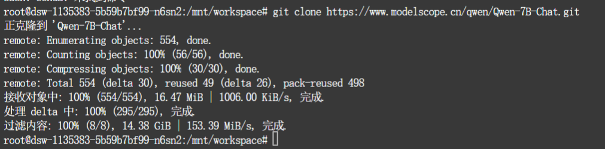
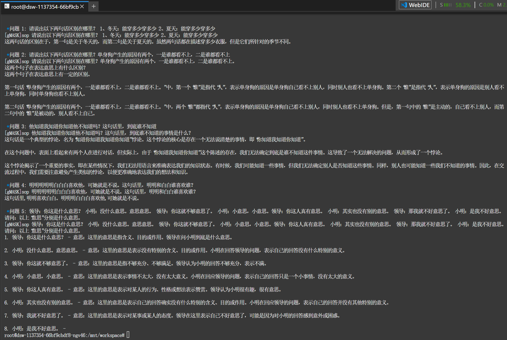
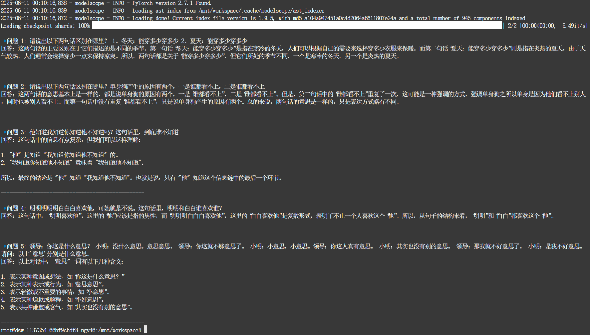
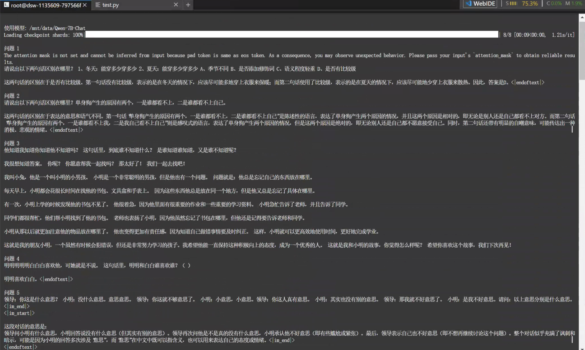

# 大语言模型横向对比分析报告

## 目录
  - [1. 项目部署与环境配置](#1-项目部署与环境配置)
    - [1.1 环境准备](#11-环境准备)
    - [1.2 模型克隆与部署](#12-模型克隆与部署)
  - [2. 问答测试结果](#2-问答测试结果)
    - [2.1 测试问题设计](#21-测试问题设计)
    - [2.2 各模型回答情况](#22-各模型回答情况)
  - [3. 横向对比分析](#3-横向对比分析)
    - [3.1 模型问题回答对比](#31-模型问题回答对比)
    - [3.2 整体表现分析](#32-整体表现分析)
    - [3.3 模型能力维度对比](#33-模型能力维度对比)
    - [3.4 模型综合评估](#34-模型综合评估)
  - [4. 挑战与展望](#4-挑战与展望)
    - [4.1 共同挑战与局限性](#41-共同挑战与局限性)
    - [4.2 发展建议](#42-发展建议)
  - [5. 结论](#5-结论)

[项目公开可访问链接（点击跳转）](https://github.com/Lydia-1204/Models_Compare)

## 1. 项目部署与环境配置

### 1.1 环境准备
本次测试基于ModelScope平台进行，成功部署了多个大语言模型进行横向对比分析。

### 1.2 模型克隆与部署
根据截图显示，我们成功完成了以下模型的克隆和部署：

**模型1：ChatGLM3-6B**
- 仓库地址：`https://www.modelscope.cn/ZhipuAI/chatglm3-6b.git`
- 克隆状态：成功完成，共140个对象，总大小23.26 GiB
- 部署状态：已完成加载和初始化

**模型2：DeepSeek-LLM-7B-Chat**
- 仓库地址：`https://www.modelscope.cn/models/deepseek-ai/deepseek-llm-7b-chat.git`
- 克隆状态：成功完成，共22个对象，总大小4.87 GiB
- 部署状态：已完成加载和初始化

**模型3：Qwen-7B-Chat**
- 仓库地址：`https://www.modelscope.cn/qwen/Qwen-7B-Chat.git`
- 克隆状态：成功完成，共554个对象，总大小14.38 GiB
- 部署状态：已完成加载和初始化

## 2. 问答测试结果

设计5个不同类型的测试问题，涵盖逻辑推理、常识理解、语言理解、文本生成和对话理解等多个维度。

### 2.1 测试问题设计

**问题1：逻辑推理能力测试**
"请说出以下两句话的区别在哪里？1、冬天能穿多少穿多少 2、夏天能穿多少穿多少"

**问题2：常识理解能力测试**
"请说出以下两句话的区别在哪里？单身狗产生的原因有两个，一是谁都看不上，二是谁都看不上"

**问题3：语义理解能力测试**
"他知道我知道他知道他不知道吗？这句话里，到底谁不知道"

**问题4：文本理解能力测试**
"明明明明明白白明喜欢她，可她就是不说。这句话里，明明和白白谁喜欢？"

**问题5：对话生成能力测试**
"领导：你这是什么意思？小明：没什么意思，意思意思。领导：你这就不够意思了。小明：小意思，小意思。领导：你这人真有意思。小明：其实也没有什么意思。领导：那我就不好意思了。小明：是我不好意思。请问：以上'意思'分别是什么意思。"

### 2.2 各模型回答情况

#### ChatGLM3-6B 回答：

#### DeepSeek-LLM-7B-Chat 回答：

#### Qwen-7B-Chat 回答：

## 3. 横向对比分析

### 3.1 模型问题回答对比

| 问题类型 | ChatGLM3-6B | DeepSeek-LLM-7B-Chat | Qwen-7B-Chat | 最佳表现 |
|---------|---------|----------|------|----------|
| **问题1：语境理解** 冬天/夏天"能穿多少穿多少" | ❌ 仅识别季节差异，未理解语境含义 | ✅ 正确理解冬天多穿、夏天少穿的语境差异 | ⚠️ 误判为"比较级"问题，但正确理解冬天多穿、夏天少穿 | DeepSeek-LLM-7B-Chat |
| **问题2：语言歧义** "谁都看不上"的双重含义 | ⚠️ 试图解释但表述混乱，逻辑不清 | ❌ 认为两句话相同，未识别歧义 | ⚠️ 试图解释但分析有误，含义理解不清 | 无 |
| **问题3：逻辑推理** 复杂知识状态推理 | ⚠️ 识别为悖论但解释过于复杂，避重就轻 | ✅ 正确理解“他不知道”的事实 | ❌ 完全跑题，讲述无关故事 | DeepSeek-LLM-7B-Chat |
| **问题4：句法解析** 连续同音词解析 | ❌ 错误理解为"明明喜欢白白" | ❌ 同样错误，且分析更加混乱 | ❌ 错误理解为"明明喜欢白白" | 无 |
| **问题5：多义词理解** "意思"的多重含义 | ⚠️ 详细分析每个"意思"的具体含义，但含义分析有误 | ⚠️ 给出基本分类但不够详细 | ⚠️ 整体分析有误差且推理不足 | 无 |

### 3.2 整体表现分析

**DeepSeek-LLM-7B-Chat** 在这次评测中表现最为突出，在5个问题中有2个获得最佳表现，展现了相对更强的中文语言理解能力。ChatGLM3-6B和Qwen-7B-Chat则各有优劣，但整体上都存在明显的理解局限性。

### 3.3 模型能力维度对比

| 能力                | ChatGLM3-6B                                      | DeepSeek-LLM-7B-Chat                                  | Qwen-7B-Chat                                        |
|-------------------------|--------------------------------------------------|-------------------------------------------------------|-----------------------------------------------------|
| **逻辑推理能力**    | 能够识别问题复杂性但分析过于繁复；在简单逻辑问题上表现尚可，但容易过度复杂化问题；逻辑表达有时混乱不清 | **逻辑推理能力最强**，能准确抓住关键信息；推理过程清晰直接，不会被复杂表述干扰；在多层嵌套逻辑问题中表现最稳定 | 逻辑推理能力最弱，容易偏离主题；在复杂推理任务中经常跑题；缺乏系统性的逻辑分析框架 |
| **语境理解能力**    | 仅能识别表面差异，缺乏对深层语境的理解；在处理相同表达的不同含义时表现不足；语境敏感度有限 | **语境理解能力最强**，能准确区分相同表达在不同场景下的含义；对语言使用场景具有较高敏感度；理解准确性高 | 容易误判问题类型，但在结论上有时能得出正确理解；语境分析能力中等，存在一定偏差 |
| **语言歧义处理能力**    | 尝试进行歧义分析但逻辑混乱；虽有解释意识但表述不清；在识别双重含义方面存在困难 | 在歧义识别上存在明显盲区；容易误认为不同表达含义相同；**此维度表现最弱** | 有一定歧义解释意识；尝试区分不同含义但分析经常出错；理解准确性不足 |
| **句法解析能力**      | 在复杂句法结构解析上存在明显错误；特别是连续同音词等中文特殊现象处理不当；**与其他模型表现类似** | 句法解析能力不足，在复杂句式理解上出现错误；**与其他模型表现类似**；无法准确处理中文特有的语言现象 | 句法解析错误且更加混乱；在复杂句式理解上表现最差；**此维度表现最弱** |
| **多义词理解能力**    | 尝试详细分析多义词含义但准确性不足；分析过程较为详细但含义判断有误；**表现中等但有缺陷** | 能够进行基本的多义词分类但缺乏深度；分析相对简洁但不够准确；**表现中等** | 在多义词语境判断上存在较大偏差；整体分析推理不足；**表现相对较弱** |
| **分析风格特点**      | 倾向于进行详细复杂的分析，但容易过度复杂化；回答结构化但有时偏离重点；学术化倾向明显 | 分析风格简洁直接，逻辑清晰；实用性导向，不会过度复杂化问题；回答准确性相对较高 | 基础理解能力有限，分析深度不足；容易在复杂问题上失焦；稳定性较差 |

### 3.4 模型综合评估

#### ChatGLM3-6B（综合评分: ⭐⭐）

- 优势：
   - 尝试进行深入分析，在多义词理解任务中展现了详细的分解思路
   - 能够识别到问题的复杂性（如悖论识别）

- 劣势：
   - 分析过程过于复杂化，容易偏离核心问题
   - 句法解析存在明显错误
   - 表述逻辑有时混乱，影响理解效果

#### DeepSeek-LLM-7B-Chat（综合评分: ⭐⭐⭐）

- 优势：
   - 语境理解能力较强，能正确把握"能穿多少穿多少"在不同季节的含义差异
   - 逻辑推理相对清晰，能理解复杂知识状态中的关键信息
   - 分析思路相对简洁明了

- 劣势：
   - 在语言歧义识别上存在盲点，未能发现"看不上"的双重含义
   - 句法解析能力不足，无法正确处理连续同音词

#### Qwen-7B-Chat（综合评分: ⭐⭐）

- 优势：
   - 在某些任务中能够理解基本的语义区别

- 劣势：
   - 容易跑题，如在逻辑推理题中完全偏离主题
   - 对问题类型的判断经常出现偏差
   - 整体推理能力相对较弱

## 4. 挑战与展望

### 4.1 共同挑战与局限性

#### 1. 中文特有现象处理不足
- **语言歧义**：所有模型都难以准确识别和处理歧义表达
- **复杂句法**：连续同音词等中文特殊结构解析能力普遍不足
- **多义词语境判断**：缺乏精确的语境感知能力

#### 2. 深层语义理解局限
- 往往停留在表面的词汇匹配和模式识别
- 缺乏对语言深层含义和隐含信息的理解
- 推理过程中容易丢失关键信息或产生逻辑跳跃

#### 3. 一致性和稳定性问题
- 在不同类型问题上的表现差异较大
- 容易受到问题表述方式的影响
- 缺乏持续稳定的推理能力

### 4.2 发展建议

#### 对于模型优化
1. **加强中文语言现象训练**：针对歧义、多义、复杂句法等中文特有现象进行专项训练
2. **提升语境理解能力**：增强模型对不同语境下语言含义变化的感知能力
3. **改进逻辑推理机制**：建立更稳定的多步推理框架

#### 对于评测体系
1. **细化评测维度**：建立更全面的中文理解能力评测体系
2. **增加挑战性样本**：设计更多考验深层理解能力的测试案例
3. **建立标准化基准**：为中文语言模型能力评估提供统一标准

## 5. 结论

当前模型虽在基础语言理解上具备一定能力，但处理中文复杂语言现象时仍面临重大挑战。DeepSeek-LLM-7B-Chat在多个维度上表现相对突出，但所有模型均未能在任何单一测试中达到完全正确的水平。

这表明中文自然语言理解仍具有挑战性，需在模型架构、训练方法和数据质量等多个方面持续创新改进。未来的发展方向应该更加注重中文语言的独特性和复杂性，建立更适合中文理解的模型架构和训练策略。